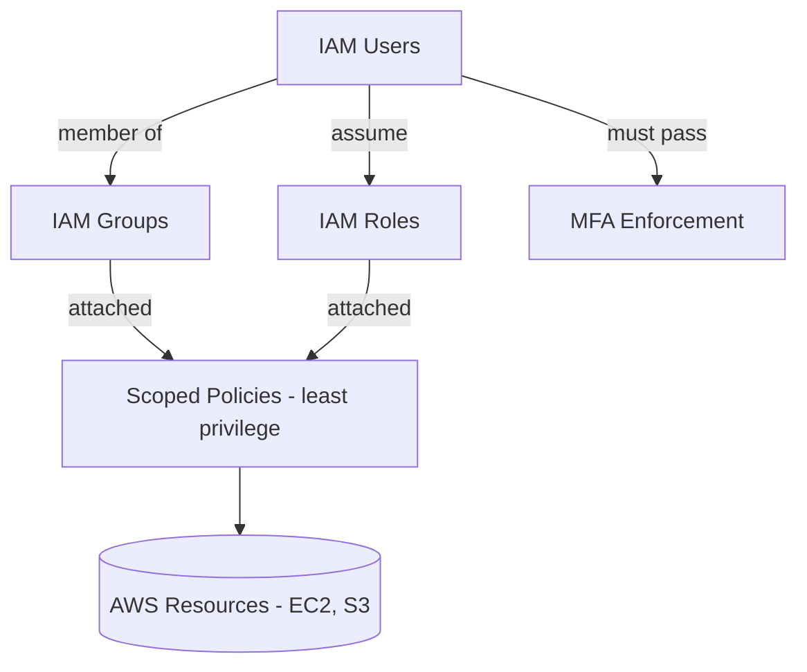

# Architecture — IAM Least-Privilege Security Implementation

An IAM security model built on least privilege: users are grouped, permissions are attached to groups and roles, and MFA is enforced.

## How it works

- IAM users are organized into groups instead of receiving permissions directly.
- Scoped policies grant only the minimum permissions required for each job function.
- IAM roles allow temporary, assumable access without long-lived credentials.
- MFA is enforced so that access to sensitive actions requires a second factor.
